# Budget Visualizer

Quick python project that:
- Grabs budget workbook data
- Parses data using Pandas
- Generate webpage of data using Dash
- Allows for Plotly plots and useful labels.

# Setup

1. Install [UV](https://docs.astral.sh/uv/getting-started/installation/)
2. Open terminal and run `uv sync`

# Command Structure

`uv run app.py --file Path_To_Excel_file.xlsx --build`

- `--file` path of excel file to parse
- `--build` create zip file of html page to download

# Provided Synthetic Example

`uv run app.py --file Assets/ExampleBudget.xlsx`

or modify dev/run scripts (linux or windows)

Example Budget provided was AI generated to avoid personal information but still provide a plausible data log.

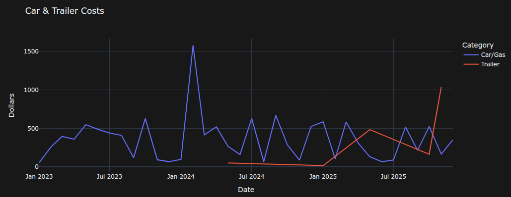

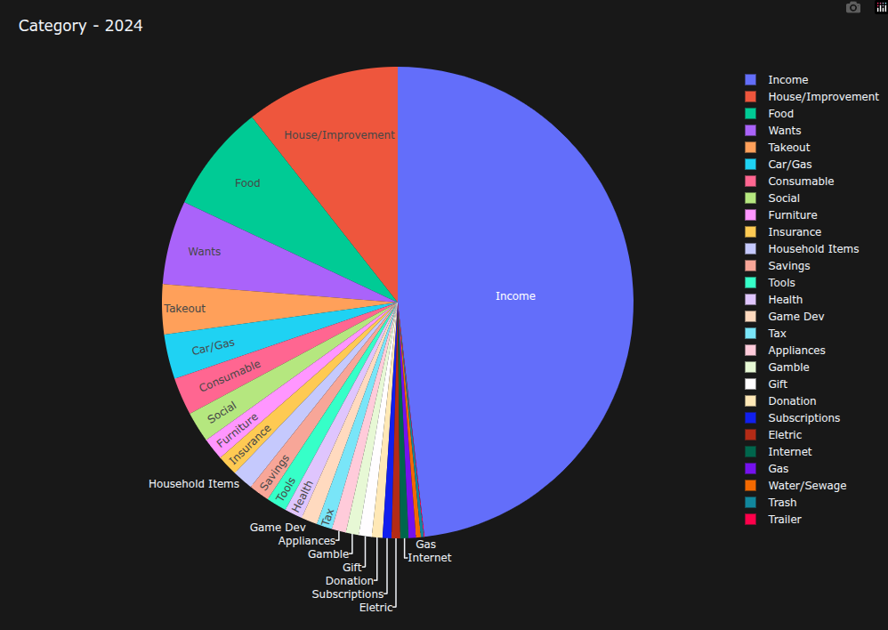

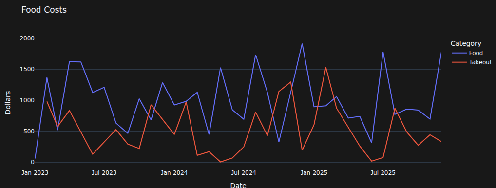

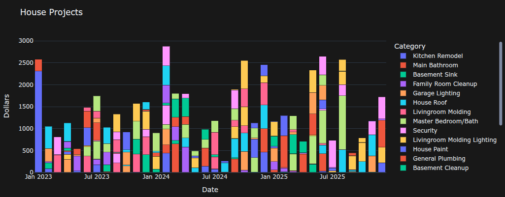

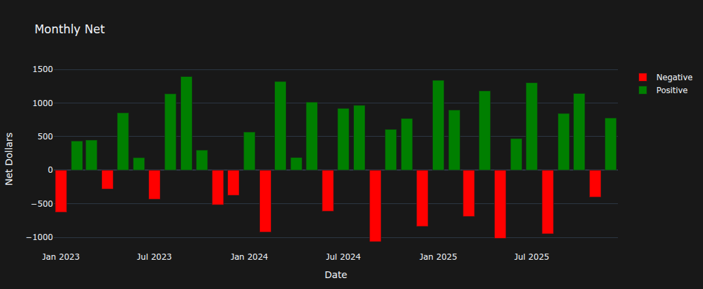

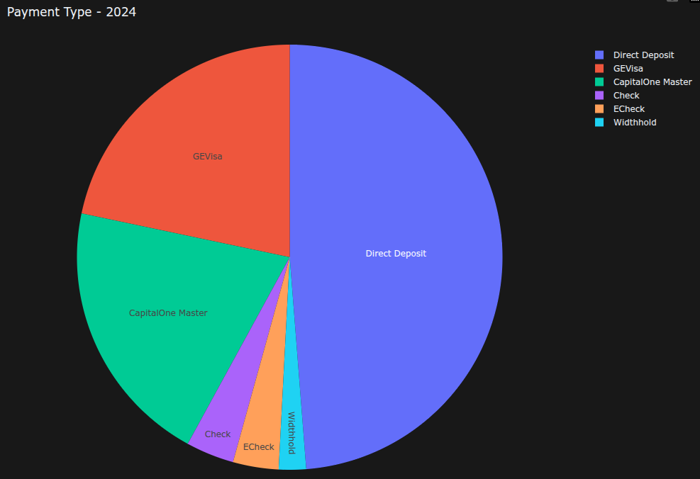

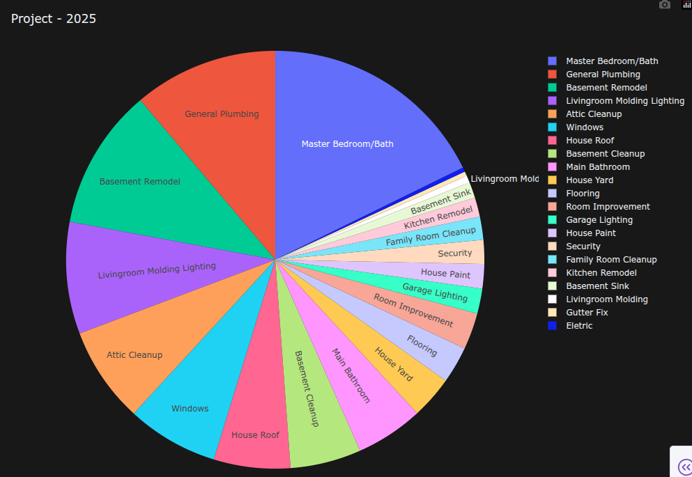

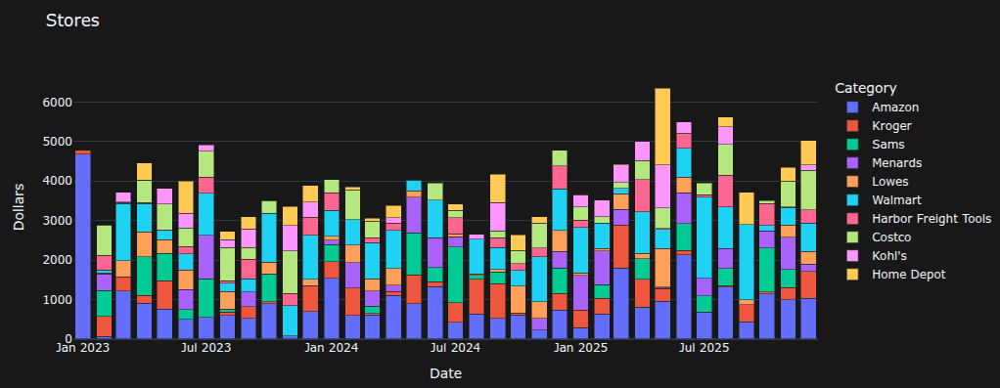

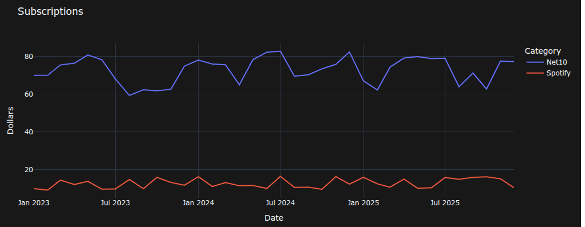

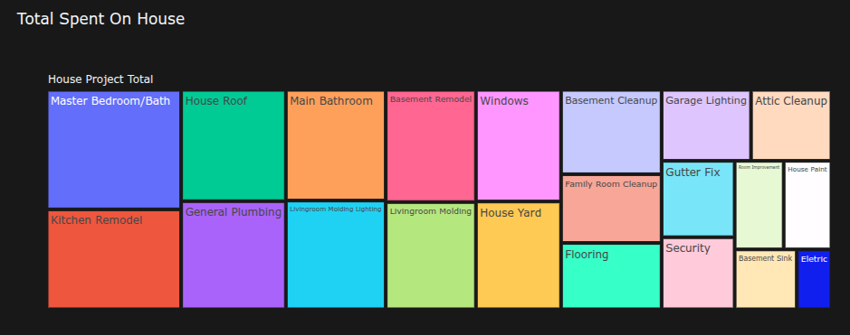

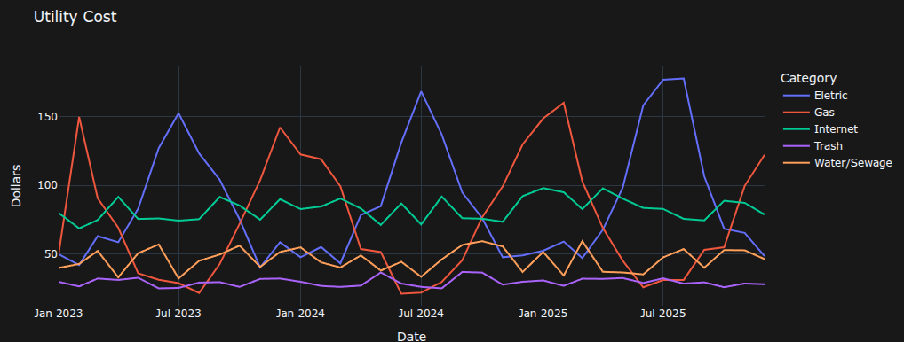

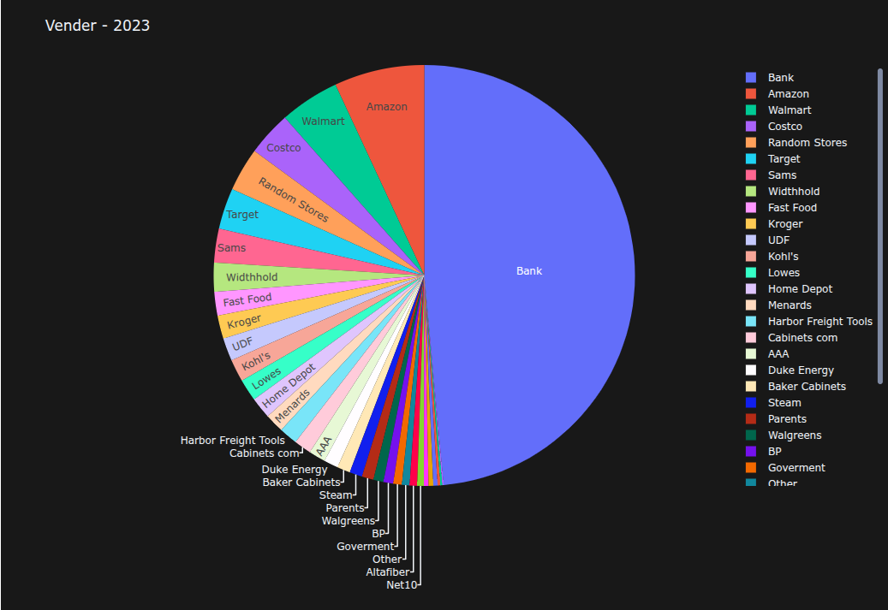
