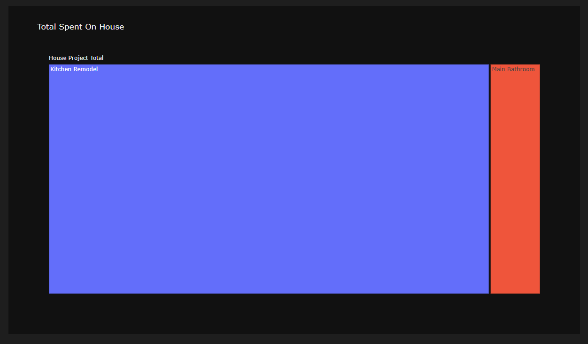
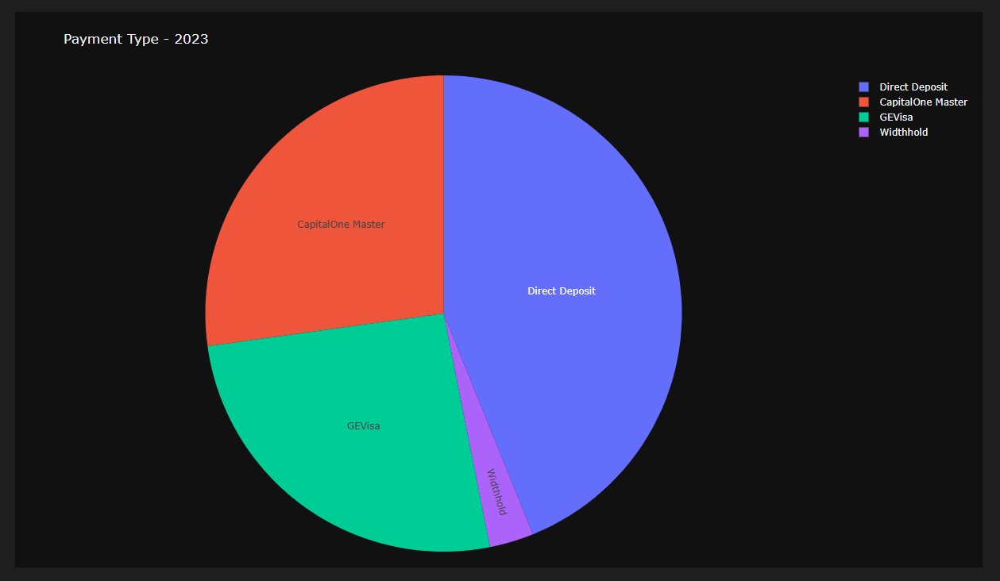
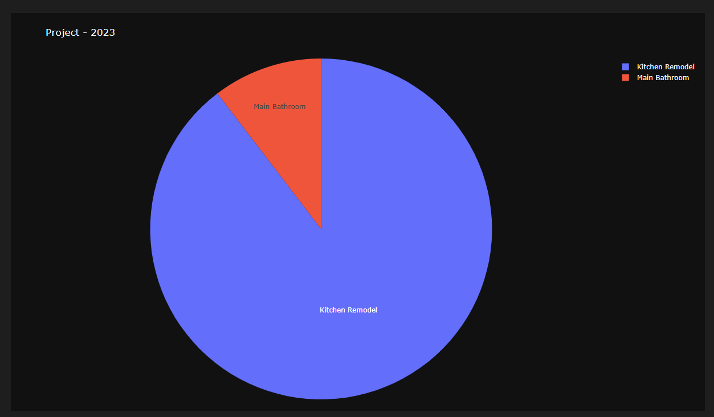
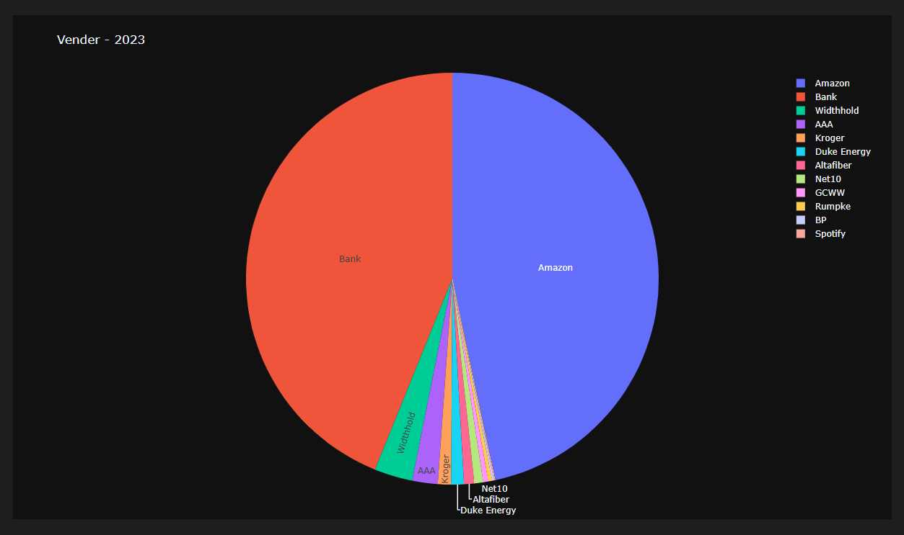
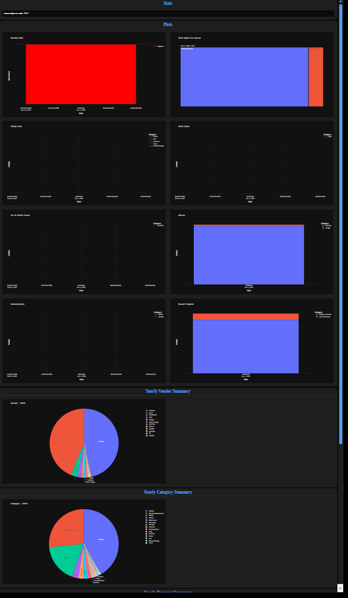

# Budget Visualizer

Quick python project that:
- Grabs budget workbook data
- Parses data using Pandas
- Generate webpage of data using Dash
- Allows for Plotly plots and useful labels.

# Setup

1. Install [UV](https://docs.astral.sh/uv/getting-started/installation/)
2. Open terminal and run `uv sync`
3. Run `uv run app.py --file Assets/ExampleBudget.xlsx`

# Run

`uv run app.py --file Assets/Budget.xlsx`

# Provided Example

Note that the example excel file is incomplete and has been randomly generated.

**Multiple months worth of real data generate interesting plots rather than the plain ones below.**

